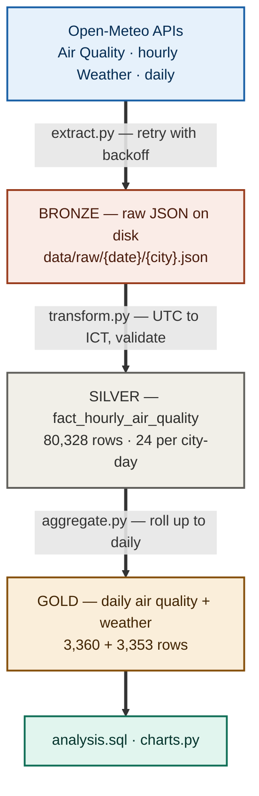
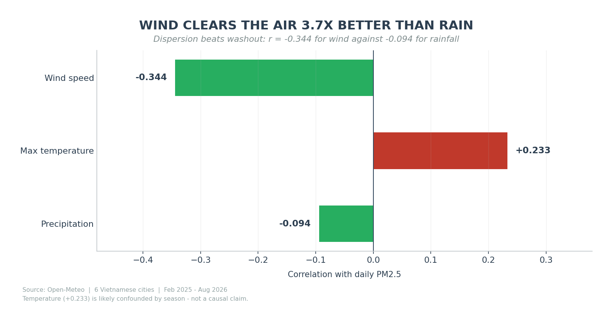
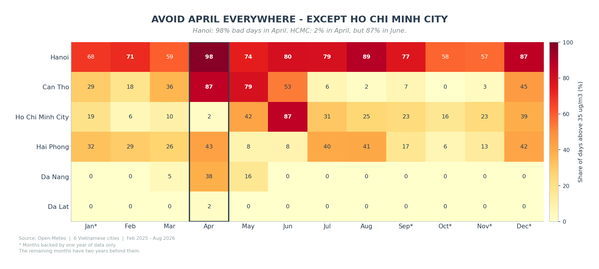

# Vietnam Air Quality Analytics ETL Pipeline

An hourly ETL pipeline that collects air quality and weather data for six
Vietnamese cities, loads it into PostgreSQL, and answers questions about what
actually drives pollution here.

<p align="center">
  <b>80,328 hourly rows</b> · <b>6 cities</b> · <b>18 months</b> · <b>99.4% complete</b> · <b>0 validation failures</b>
</p>

---

## Architecture



Raw JSON stays on disk so transforms can be re-run without re-fetching. The three
storage tiers follow the bronze/silver/gold pattern used by modern lakehouses.

**Pipeline guarantees**

| Property | How |
|---|---|
| Idempotent | `INSERT ... ON CONFLICT (city_id, datetime_utc) DO UPDATE` — verified by running the same day three times and counting rows |
| Fault-tolerant | `tenacity` retries transient network errors with exponential backoff; per-city `try/except` keeps one failure from costing the other five |
| Observable | Timestamped logs to `logs/etl_{date}.log`, non-zero exit code on failure |
| Tested | 9 unit tests on timezone conversion and validation rules — no network, no database, runs in 0.8s |

---

## The data

Two Open-Meteo APIs, no key required. Cities span all three regions: **Hanoi, Hai Phong**
(North) · **Da Nang, Da Lat** (Central) · **Ho Chi Minh City, Can Tho** (South).

| Metric | What it is | What high values point to | WHO 24h limit |
|---|---|---|---|
| **PM2.5** | Fine particles ≤2.5 µm — small enough to cross into the bloodstream | Combustion of any kind; the headline health metric | **15 µg/m³** |
| **PM10** | Coarse particles ≤10 µm — **includes PM2.5 by definition** | Road dust, construction. A PM2.5/PM10 ratio near 1 means combustion, not mechanical dust | 45 µg/m³ |
| **NO₂** | Nitrogen dioxide from high-temperature combustion | **Traffic** — the most reliable vehicle marker | 25 µg/m³ |
| **SO₂** | Sulphur dioxide from sulphur-bearing fuel | **Coal burning / heavy industry** — modern vehicles use desulphurised fuel and emit almost none | 40 µg/m³ |
| **CO** | Carbon monoxide from incomplete combustion | Motorbikes, charcoal stoves. Pairs with NO₂ as a traffic signal | 4,000 µg/m³ |
| **O₃** | **Ground-level** ozone — a pollutant, not the protective ozone layer | Not emitted directly; forms when sunlight breaks down NO₂. Ironically higher where dust is *lower* | 100 µg/m³ |
| **UV** | Solar UV intensity — not a pollutant | The driver behind ozone formation; explains its daily cycle | — |

Weather: `precipitation_sum` (mm), `windspeed_10m_max` (km/h), `temperature_2m_max/min` (°C).

> **Which standard?** Every "exceedance" figure below uses WHO's **15 µg/m³**. Vietnam's
> national standard (QCVN 05:2023) allows **50 µg/m³** — the same days look very different
> under each. The stricter threshold is used deliberately and stated everywhere.

---

## Results

### 1 · Hanoi exceeded the WHO guideline on 552 of 557 days


Four of six cities are above the guideline on more than 85% of days. Da Lat — a highland
city with little industry — is the only one that stays mostly clean, which also proves
low levels are achievable in Vietnam rather than a foreign luxury.

### 2 · April spikes repeat in both years


A calendar-month average would have hidden this. Plotting all 19 months in sequence shows
Hanoi peaking at 68.9 then 67.0 µg/m³ two Aprils running — a repeated pattern, not a
one-off. Ho Chi Minh City runs in antiphase: April is its *cleanest* month.

### 3 · Rain works — but the correlation coefficient nearly hid it


Pearson correlation between rainfall and PM2.5 is only **−0.094**, which reads as "no
relationship". Bucketing by intensity tells a different story: every bucket declines in
order, and dry days *gain* +1.57 µg/m³ against the previous day while heavy-rain days
*lose* −1.71.

The coefficient is low because 46% of days fall into the light-rain bucket, where the
effect is near zero — enough mass to dilute a linear fit. **A weak correlation means the
relationship isn't linear, not that it doesn't exist.**

### 4 · Wind, not rain, is what clears the air



Wind correlates at −0.344 against rainfall's −0.094: dispersion beats washout by roughly
3.7×. The positive temperature coefficient (+0.233) is most likely confounded by season —
northern winters are both cold and polluted — so it is reported, not interpreted causally.

### 5 · Hanoi and Ho Chi Minh City are polluted for different reasons


Hanoi's SO₂ runs **12.6× Da Lat's**, pointing at thermal power or heavy industry. Ho Chi
Minh City instead leads on NO₂ and CO — the traffic pair — despite ranking only third on
PM2.5.

Same symptom, two different causes, two different policy responses. This only became
visible because the pipeline collects six pollutants rather than PM2.5 alone.

### 6 · Avoid April everywhere — except Ho Chi Minh City



Hanoi records bad air on 98% of April days; Ho Chi Minh City on 2%, with its own peak
arriving in June. The April clustering across five cities, repeated in both years, is
consistent with post-harvest field burning — confirming that would need satellite fire
data, which is outside this project's scope.

---

## What the data settled

| Question | Answer | Evidence |
|---|---|---|
| Does rain clean the air? | **Yes, modestly** — 20% lower on heavy-rain days | Monotonic decline across four rain buckets; day-over-day change flips from +1.57 to −1.71 |
| Does pollution peak at rush hour? | **No** — peaks at 6am and 10pm, bottoms at noon | Rush hours fall where PM2.5 is already declining; the cycle tracks thermal inversion, not traffic volume |
| Are weekends cleaner? | **No** — equal or slightly worse in all six cities | Max gap 2.3 µg/m³, wrong direction. Combined with the point above, traffic isn't what drives the short-term cycle |
| Which weather factor matters most? | **Wind**, by 3.7× over rain | r = −0.344 vs −0.094 |
| Do the big cities share a cause? | **No** | Hanoi: SO₂ 12.6× Da Lat (coal). HCMC: highest NO₂ and CO (traffic) |
| Is pollution chronic or episodic? | **Both, depending on city** | Hanoi: 400 of 557 days inside an episode, spread over 45 separate runs. Can Tho: only 18 episodes but the longest single run in the country, 42 days |
| Which pollutants move together? | PM2.5 ≈ PM10 (r = 0.996) | Ratio near 1 means combustion, not road dust. NO₂–CO at 0.661 confirms a shared traffic source |
| Does the data behave physically? | **Yes** | NO₂ and O₃ run in antiphase; O₃ tracks UV at r = 0.516 — the textbook photochemical cycle, reproduced from raw API data |
| Is air quality improving? | **Too early to say** | Only 7 months overlap across the two years — enough to confirm repeated seasonal patterns, not enough for a trend claim |

Full working, including the queries behind each answer: [`sql/analysis.sql`](sql/analysis.sql)

---

## Setup

```bash
git clone https://github.com/Tuong1308/airquality-etl.git
cd airquality-etl

python -m venv venv && source venv/Scripts/activate    # Linux/macOS: venv/bin/activate
pip install -r requirements.txt

cp .env.example .env                                    # fill in your database password
psql -U postgres -c "CREATE DATABASE airquality;"
psql -U <user> -d airquality -f sql/schema.sql
```

## Running it

```bash
python -m src.main --date 2026-06-01                    # one specific day
python -m src.main --yesterday                          # what a scheduler would call
python -m src.main --start-date 2025-02-01 --end-date 2026-08-12   # backfill
python -m src.main --lookback 7                         # re-run last week, filling gaps
python -m src.charts                                    # regenerate charts from the database
pytest                                                  # 9 tests, no network, 0.8s
```

A single day takes **~16 seconds** across all six cities. The full 18-month backfill —
558 days, roughly 6,700 API calls — runs in about **1.6 hours**.

---

## Design decisions

| Decision | Why | Alternative considered |
|---|---|---|
| Keep raw JSON before transforming | Re-run transforms without re-fetching; fix past bugs retroactively | Transform in flight — loses the ability to correct history |
| Natural key `(city_id, datetime_utc)` | Foundation for idempotent upserts; the database itself rejects duplicates | `SERIAL` — silently duplicates rows on re-run |
| `datetime_utc` as `TIMESTAMPTZ`, `datetime_local` as `TIMESTAMP` | `TIMESTAMPTZ` normalises to UTC internally, so two such columns would store identical values and the local column would be meaningless | Both as `TIMESTAMPTZ` — caught during schema review, before any data was loaded |
| `INSERT ... ON CONFLICT DO UPDATE` | Any day can be re-run safely | Delete-then-insert — simpler and handles source deletions, but loses insert history |
| Aggregate `target_date` **and** `target_date + 1` | A UTC batch feeds two local dates at +7h, so aggregating one leaves the other stale | Aggregating one date — measured a **34% error** on Can Tho before this was fixed |
| `hours_recorded` on the daily table | Separates a complete day from a partial one; every analytical query filters on it | Assuming completeness — the 34% error above stayed invisible without this column |
| Per-city error isolation | One city failing doesn't cost the other five | Global try/except — a single failure loses the whole day |
| `NUMERIC` over `FLOAT` | Avoids accumulated rounding error in aggregates | `FLOAT` — lighter but imprecise |

**Validation runs in three tiers**, on the principle that one bad column shouldn't
discard a whole row:

| Check | Action | Rationale |
|---|---|---|
| Missing key | **Drop row** | Cannot be stored |
| Negative reading | **Set NULL, keep row** | Physically meaningless, but the other columns still hold |
| PM2.5 > 1000 µg/m³ | **Flag, keep row** | Could be a genuine wildfire |
| PM2.5 > PM10 | **Log ERROR, keep row** | PM2.5 is a subset of PM10 — a violation is certainly a source error |

Across all 80,328 rows: **zero violations**. Open-Meteo's data proved consistently clean
over the full 18 months. The rules stay as a guard against future schema drift.

---

## Known limitations

- **No orchestration yet.** The pipeline exposes `--yesterday` and `--lookback N` for a
  scheduler, but nothing calls them automatically. Windows Task Scheduler was skipped
  deliberately in favour of moving straight to Airflow. The Linux cron equivalent:
  ```
  0  6 * * *  cd /path/to/airquality-etl && venv/bin/python -m src.main --yesterday
  30 6 * * 0  cd /path/to/airquality-etl && venv/bin/python -m src.main --lookback 7
  ```
- **Charts regenerate manually** via `python -m src.charts`. They read live from the
  database, so they're never more than one run stale — but nothing schedules them.
- **18 months is too short for trend claims.** Only February–August overlaps across both
  years. Patterns repeating in both years are treated as patterns; anything appearing once
  is treated as an event.
- **The `dust` variable was dropped.** It returned 0.0 across all six cities for the entire
  period. Cross-checking against Dubai (24–72 µg/m³) confirmed the model doesn't cover
  Southeast Asia, rather than the request being malformed.
- **No failure alerting**, **no Docker packaging**, **local PostgreSQL only**.

---

## What's next

Project 2 turns this into an orchestrated pipeline. Most of the groundwork is in place:

| Today | Becomes |
|---|---|
| `run_one_day()` | A task in an Airflow DAG |
| `--date` | `{{ ds }}` |
| Validation inside `transform.py` | `dbt test` |
| `aggregate.py` | A dbt mart model |
| Manual `python -m src.charts` | A `generate_charts` task downstream of `aggregate` |
| Local PostgreSQL | Docker Compose |

Beyond orchestration: a dashboard reading live from the warehouse, and correlating the
April spikes against satellite fire-detection data to test the field-burning hypothesis.

---

<sub>Python 3.13 · PostgreSQL 15 · pandas · SQLAlchemy · psycopg2 · tenacity · pytest · matplotlib · Data: [Open-Meteo](https://open-meteo.com)</sub>