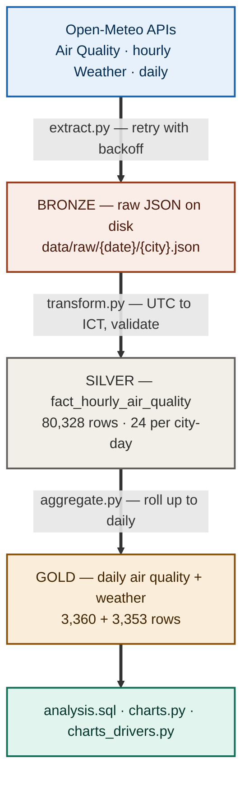
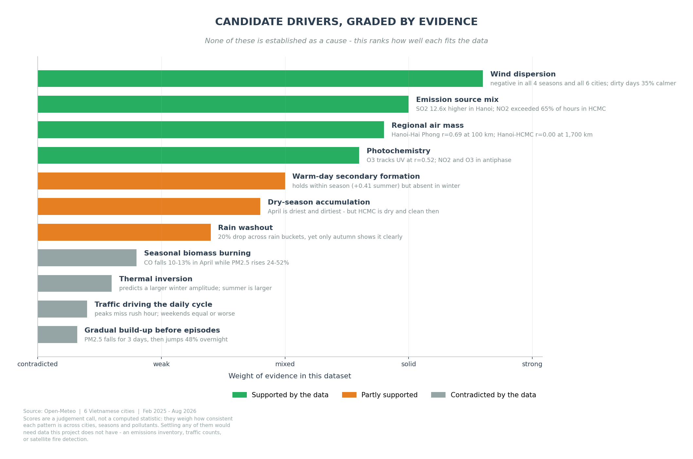

# Vietnam Air Quality ETL Pipeline

An hourly ETL pipeline that collects air quality and weather data for six
Vietnamese cities, loads it into PostgreSQL, and uses it to work out what
actually drives pollution here — and what does not.

<p align="center">
  <b>80,328 hourly rows</b> · <b>6 cities</b> · <b>18 months</b> · <b>99.4% complete</b> · <b>0 validation failures</b>
</p>

---

## Architecture



Raw JSON stays on disk so transforms can be re-run without re-fetching. The
three storage tiers follow the bronze/silver/gold pattern used by modern
lakehouses.

| Property | How |
|---|---|
| Idempotent | `INSERT ... ON CONFLICT DO UPDATE` — verified by running the same day three times and counting rows |
| Fault-tolerant | `tenacity` retries transient network errors; per-city `try/except` keeps one failure from costing the other five |
| Observable | Timestamped logs to `logs/etl_{date}.log`, non-zero exit code on failure |
| Tested | 9 unit tests on timezone conversion and validation rules — no network, no database, 0.8s |

---

## The data

Two Open-Meteo APIs, no key required. Cities span all three regions:
**Hanoi, Hai Phong** (North) · **Da Nang, Da Lat** (Central) ·
**Ho Chi Minh City, Can Tho** (South).

| Metric | What it is | What high values point to | WHO 24h limit |
|---|---|---|---|
| **PM2.5** | Fine particles ≤2.5 µm — small enough to cross into the bloodstream | Combustion of any kind; the headline health metric | **15 µg/m³** |
| **PM10** | Coarse particles ≤10 µm — **includes PM2.5 by definition** | Road dust, construction. A PM2.5/PM10 ratio near 1 means combustion, not mechanical dust | 45 µg/m³ |
| **NO₂** | Nitrogen dioxide from high-temperature combustion | **Traffic** — the most reliable vehicle marker | 25 µg/m³ |
| **SO₂** | Sulphur dioxide from sulphur-bearing fuel | **Coal burning / heavy industry** — modern vehicles emit almost none | 40 µg/m³ |
| **CO** | Carbon monoxide from incomplete combustion | Motorbikes, charcoal stoves. Pairs with NO₂ as a traffic signal | 4,000 µg/m³ |
| **O₃** | **Ground-level** ozone — a pollutant, not the protective ozone layer | Not emitted directly; forms when sunlight breaks down NO₂ | 100 µg/m³ |
| **UV** | Solar UV intensity — not a pollutant | The driver behind ozone formation | — |

Weather: `precipitation_sum` (mm), `windspeed_10m_max` (km/h),
`temperature_2m_max/min` (°C).

> **Which standard?** Every exceedance figure below uses WHO's **15 µg/m³**.
> Vietnam's national standard (QCVN 05:2023) allows **50 µg/m³** — the same days
> look very different under each. The stricter threshold is used deliberately and
> stated throughout.

---

# Part 1 — What the air is like

## Hanoi exceeded the WHO guideline on 552 of 557 days


Four of six cities are above the guideline on more than 85% of days.

Da Lat is the exception at 17.4%, and it recorded **no sustained pollution
episode at all** in eighteen months. That matters more than it first appears: it
means low levels are achievable in Vietnam, so the problem lies in emission
sources rather than in the tropical climate.

## Patterns repeat, which makes them patterns rather than events


Plotting all nineteen months in sequence — rather than averaging by calendar
month — shows Hanoi peaking at 68.9 then 67.0 µg/m³ two Aprils running. A single
spike could be an accident; the same spike in consecutive years is a pattern.

Ho Chi Minh City runs in antiphase: April is its *cleanest* month. That contrast
turns out to be the first hint of something the rest of this analysis keeps
running into — the six cities do not behave like one country.

---

# Part 2 — Three ways the obvious answer is wrong

The intuitive reading of Part 1 is that Vietnam has an air pollution problem,
measured by PM2.5, caused by traffic and industry. Each of those three
assumptions turns out to be wrong in a different way.

## It is not one problem — it is at least three


Hanoi and Ho Chi Minh City correlate at **−0.008**. A bad day in one says
nothing about the other.

Hanoi and Hai Phong, 100 km apart, correlate at 0.691 — they share an air mass.
But Ho Chi Minh City and Can Tho, only 170 km apart, manage just 0.260, and Da
Lat correlates *negatively* with Ho Chi Minh City despite a 300 km gap, sitting
1,500 m above the lowland air.

Three systems, not one national problem. A single national policy would be
aimed at a phenomenon that does not exist.

## It is not one pollutant — the ranking flips


Da Nang ranks **5th of 6 on PM2.5** and **1st of 6 on ozone**, with 53.9% of
hours above the WHO limit — twice Hanoi's share.

The mechanism explains itself: ozone is not emitted, it forms when sunlight
breaks down NO₂. Less dust means more UV reaching ground level. The least dusty
city ends up with the most ozone precisely *because* it is clean.

A "cleanest cities in Vietnam" ranking built on PM2.5 would put Da Nang near the
top and miss its actual problem entirely.

## It is not one cause — the two big cities differ


SO₂ is a coal marker: modern vehicles run on desulphurised fuel and emit almost
none of it. Hanoi's SO₂ runs **12.6× Da Lat's**, and exceeds the WHO limit in
12.6% of hours.

Ho Chi Minh City instead leads on NO₂ and CO — the traffic pair — exceeding the
NO₂ limit in **65% of hours** despite ranking only third on PM2.5.

Same symptom, different causes, and therefore different remedies. This only
became visible because the pipeline collects six pollutants rather than PM2.5
alone.

---

# Part 3 — What travels with pollution

Emission sources set the baseline. Weather decides what happens to those
emissions once they are in the air — and it turns out to leave a much clearer
fingerprint than the sources themselves.

## Dirty days are still, dry and cloudless


Comparing the dirtiest 10% of days against the cleanest 10%, pooled across all
cities: wind is 35% weaker, rainfall 64% lower, and the day-night temperature
range 50% wider.

The direction is not settled, though. Calm dry weather plausibly lets particles
accumulate — but heavy particle loading also suppresses cloud formation, which
would widen the temperature range on its own. Both readings fit these numbers.

## And the same weather does different things in different cities


Wind is the one factor pointing the same way everywhere, though its strength
ranges from −0.51 in Da Lat to −0.16 in coastal Da Nang.

Ho Chi Minh City reverses sign on three of four factors. Rain there arrives
*with* higher PM2.5, not lower — a pattern that fits monsoon seasonality rather
than rainfall washing particles out.

Rain is the clearest case of a signal that a single coefficient nearly buried.
Pearson correlation between rainfall and PM2.5 is only **−0.094**, which reads
as "no relationship" — but bucketing by intensity shows every bucket declining
in order, with dry days *gaining* +1.57 µg/m³ against the previous day and
heavy-rain days *losing* −1.71. The coefficient is low because 46% of days fall
into the light-rain bucket, where the effect is near zero.

**A weak correlation means the relationship is not linear, not that it does not
exist.** ([chart](charts/03_rain_effect.png))

---

# Part 4 — Four assumptions the data contradicts

This is where the analysis earns its keep. Each of these seemed obvious enough
to state without checking; each turned out to be wrong.

### Traffic drives the daily cycle


PM2.5 peaks at **6am and 10pm** and bottoms out at midday. Both rush hours fall
where the curve is already declining.

Weekends provide a second, independent check — and they are **equal or slightly
worse** than weekdays in all six cities, with the largest gap just 2.3 µg/m³ in
the wrong direction. If commuter traffic set the daily rhythm, neither result
would look like this.

### Thermal inversion explains the overnight peak

The textbook explanation, and the one an earlier draft of this README asserted.
Two independent checks contradict it:

| Check | Inversion predicts | Data shows |
|---|---|---|
| PM2.5 against day-night temperature range | Rises steadily | 22.1 → 29.8 → 30.0 → **27.7** (rises, then falls) |
| Day-night amplitude by season | Larger in winter | Summer **35.6** vs winter **30.2** |

Inversion is strongest in cold weather, so the seasonal amplitude should be
larger in winter. It is larger in summer. Daytime convective mixing fits the
midday trough better, but the temperature correlation below cuts against that
too — the mechanism is genuinely unresolved here.

### The temperature signal is a seasonal artefact

Temperature correlates with PM2.5 at +0.233 overall, which looked like seasonal
confounding — northern winters being both cold and polluted.

Splitting by season should have dissolved it. Instead it **strengthened**:
+0.414 in summer, +0.409 in autumn, with only winter near zero. Within a given
season, warmer days really are dirtier.

### April's peak comes from field burning

April is the worst month in five of six cities, repeating in both years, and it
is also the driest — 2.1mm against 8–12mm later in the year. Post-harvest field
burning is the intuitive explanation.

The chemistry argues against it. In April, PM2.5 rises 24–52% while CO **falls
10–13%** in Hanoi, Hai Phong and Can Tho. Combustion produces CO. Whatever
drives the April peak, it does not look like local burning.

### And one that survived

Episodes were expected to build gradually. They do not: averaged over 223
onsets, PM2.5 *drifts downward* for three days, then jumps **48% overnight**.

That rules out gradual accumulation and points to a discrete trigger — a wind
shift, an incoming air mass. It also means the PM2.5 series carries no
early-warning signal; forecasting would have to lean on meteorology instead.

<sub>Supporting charts for this section:
[seasonal weather correlations](charts/04_weather_correlation.png) ·
[bad-day share by month](charts/06_month_heatmap.png) ·
[sustained episodes](charts/08_episodes.png)</sub>

---

# Part 5 — Where that leaves the causes

Pulling the four parts together: some candidate drivers survive every check,
some hold up in places and fail in others, and four fall over outright.



| Verdict | Drivers |
|---|---|
| **Supported** | Wind dispersion · emission source mix · regional air mass · photochemistry |
| **Partly supported** | Warm-day secondary formation · dry-season accumulation · rain washout |
| **Contradicted** | Seasonal biomass burning · thermal inversion · traffic driving the daily cycle · gradual build-up |

None of these is established as a cause. The dataset has no emissions inventory,
no traffic counts and no fire-detection data — the most it can do is show which
factors travel with pollution and which do not.

What it does establish is narrower and firmer:

- **The scope is regional**, not national — three independent systems
- **There is more than one kind of problem** — particulate and photochemical
- **Weather modulates rather than creates** — it decides whether particles
  accumulate or disperse, not whether they exist
- **Four intuitive explanations are wrong**, each contradicted by a specific
  measurement

Settling the rest would need an emissions inventory, satellite fire detection
(NASA FIRMS), wind direction, and traffic counts. All outside this project's
scope, and all named in the code comments where they would fit.

---

## Setup

```bash
git clone https://github.com/Tuong1308/airquality-etl.git
cd airquality-etl

python -m venv venv && source venv/Scripts/activate    # Linux/macOS: venv/bin/activate
pip install -r requirements.txt

cp .env.example .env                                    # fill in your database password
psql -U postgres -c "CREATE DATABASE airquality;"
psql -U <user> -d airquality -f sql/schema.sql
```

## Running it

```bash
python -m src.main --date 2026-06-01                    # one specific day
python -m src.main --yesterday                          # what a scheduler would call
python -m src.main --start-date 2025-02-01 --end-date 2026-08-12   # backfill
python -m src.main --lookback 7                         # re-run last week, filling gaps
python -m src.charts                                    # regenerate the descriptive charts
python -m src.charts_drivers                            # regenerate the driver-evidence charts
pytest                                                  # 9 tests, no network, 0.8s
```

A single day takes **~16 seconds** across all six cities. The full 18-month
backfill — 558 days, roughly 6,700 API calls — runs in about **1.6 hours**.

---

## Design decisions

| Decision | Why | Alternative considered |
|---|---|---|
| Keep raw JSON before transforming | Re-run transforms without re-fetching; fix past bugs retroactively | Transform in flight — loses the ability to correct history |
| Natural key `(city_id, datetime_utc)` | Foundation for idempotent upserts; the database itself rejects duplicates | `SERIAL` — silently duplicates rows on re-run |
| `datetime_utc` as `TIMESTAMPTZ`, `datetime_local` as `TIMESTAMP` | `TIMESTAMPTZ` normalises to UTC internally, so two such columns would store identical values | Both as `TIMESTAMPTZ` — caught in schema review, before any data was loaded |
| `INSERT ... ON CONFLICT DO UPDATE` | Any day can be re-run safely | Delete-then-insert — simpler, handles source deletions, but loses insert history |
| Aggregate `target_date` **and** `target_date + 1` | A UTC batch feeds two local dates at +7h | Aggregating one date — measured a **34% error** on Can Tho before this was fixed |
| `hours_recorded` on the daily table | Separates a complete day from a partial one; every analytical query filters on it | Assuming completeness — the 34% error stayed invisible without this column |
| Per-city error isolation | One city failing doesn't cost the other five | Global try/except — a single failure loses the whole day |
| Collect six pollutants, not just PM2.5 | Made the Da Nang ozone finding and the Hanoi/HCMC source split possible | PM2.5 only — cheaper, and would have produced a confidently wrong ranking |

**Validation runs in three tiers**, on the principle that one bad column should
not discard a whole row:

| Check | Action | Rationale |
|---|---|---|
| Missing key | **Drop row** | Cannot be stored |
| Negative reading | **Set NULL, keep row** | Physically meaningless, but the other columns still hold |
| PM2.5 > 1000 µg/m³ | **Flag, keep row** | Could be a genuine wildfire |
| PM2.5 > PM10 | **Log ERROR, keep row** | PM2.5 is a subset of PM10 — a violation is certainly a source error |

Across all 80,328 rows: **zero violations**. The rules stay as a guard against
future schema drift.

---

## Known limitations

- **No orchestration yet.** The pipeline exposes `--yesterday` and `--lookback N`
  for a scheduler, but nothing calls them automatically. Windows Task Scheduler
  was skipped deliberately in favour of moving straight to Airflow. The Linux
  cron equivalent:
  ```
  0  6 * * *  cd /path/to/airquality-etl && venv/bin/python -m src.main --yesterday
  30 6 * * 0  cd /path/to/airquality-etl && venv/bin/python -m src.main --lookback 7
  ```
- **Charts regenerate manually.** They read live from the database, so they are
  never more than one run stale — but nothing schedules them.
- **Eighteen months is too short for trend claims.** Only February–August
  overlaps across both years. Patterns repeating in both years are treated as
  patterns; anything appearing once is treated as an event.
- **Correlation is not causation, and this README says so repeatedly.** The
  driver grading in Part 5 is a judgement about fit, not a statistical test.
- **The `dust` variable was dropped.** It returned 0.0 across all six cities for
  the entire period. Cross-checking against Dubai (24–72 µg/m³) confirmed the
  model does not cover Southeast Asia, rather than the request being malformed.
- **No failure alerting**, **no Docker packaging**, **local PostgreSQL only**.

---

## What's next

Project 2 turns this into an orchestrated pipeline. Most of the groundwork is
in place:

| Today | Becomes |
|---|---|
| `run_one_day()` | A task in an Airflow DAG |
| `--date` | `{{ ds }}` |
| Validation inside `transform.py` | `dbt test` |
| `aggregate.py` | A dbt mart model |
| Manual chart regeneration | A `generate_charts` task downstream of `aggregate` |
| Local PostgreSQL | Docker Compose |

On the analysis side, the open questions have concrete next steps: satellite
fire detection to settle the April question, wind direction to trace incoming
air masses, and an emissions inventory to turn the source fingerprints into
actual attributions.

---

<sub>Python 3.13 · PostgreSQL 15 · pandas · SQLAlchemy · psycopg2 · tenacity · pytest · matplotlib · Data: <a href="https://open-meteo.com">Open-Meteo</a></sub>