<div align="center">

# Vietnam Air Quality — ETL & Analysis

*Testing which explanations for Vietnam's air pollution survive the data*

[](https://www.python.org)
[](https://www.postgresql.org)
[](https://pandas.pydata.org)
[](https://matplotlib.org)
[](tests/)
[](https://open-meteo.com)

**80,328 hourly rows** · **6 cities** · **18 months** · **99.4% complete** · **0 validation failures**

[Overview](#overview) • [Dataset](#dataset) • [Methodology](#methodology) • [Key findings](#key-findings) • [Hypothesis testing](#hypothesis-testing) • [Limitations](#limitations) • [Getting started](#getting-started)

</div>

Hourly air quality and weather data for six Vietnamese cities, collected from the
Open-Meteo APIs, loaded into PostgreSQL, and used to test which common
explanations for the country's pollution hold up — and which do not.

---

## Overview

Vietnamese air pollution is usually discussed as a single national problem with a
single set of causes: traffic, field burning, winter inversions. This project
builds the data infrastructure needed to check those claims, then checks them.

**Questions the analysis answers:**

1. How bad is the air, and how consistently, across the three regions?
2. Do the cities form one air shed or several independent ones?
3. Does PM2.5 alone describe the problem, or does the ranking change with other pollutants?
4. How much of the day-to-day variation is weather rather than emissions?
5. Which of the standard explanations survive a specific, falsifiable test?

**Headline result:** the country holds at least three independent pollution
systems, PM2.5 alone ranks the cities wrongly, and four of five intuitive
explanations fail a test the data can run.

---

## Dataset

Two Open-Meteo APIs, no key required. Cities span all three regions:
**Hanoi, Hai Phong** (North) · **Da Nang, Da Lat** (Central) ·
**Ho Chi Minh City, Can Tho** (South).

| Property | Value |
|---|---|
| Grain | Hourly, rolled up to daily |
| Period | 2025-02-01 → 2026-08-14 (560 consecutive days) |
| Volume | 80,472 hourly rows · 3,360 daily rows · 3,353 daily weather rows |
| Completeness | 3,341 days with a full 24 hours (99.4%); weather join 100% |
| Validation | 0 violations across all rows |

### Metrics collected

| Metric | What it is | What high values point to | WHO 24h limit |
|---|---|---|---|
| **PM2.5** | Fine particles ≤2.5 µm — small enough to cross into the bloodstream | Combustion of any kind; the headline health metric | **15 µg/m³** |
| **PM10** | Coarse particles ≤10 µm — **includes PM2.5 by definition** | Road dust, construction. A PM2.5/PM10 ratio near 1 means combustion, not mechanical dust | 45 µg/m³ |
| **NO₂** | Nitrogen dioxide from high-temperature combustion | **Traffic** — the most reliable vehicle marker | 25 µg/m³ |
| **SO₂** | Sulphur dioxide from sulphur-bearing fuel | **Coal burning / heavy industry** — modern vehicles emit almost none | 40 µg/m³ |
| **CO** | Carbon monoxide from incomplete combustion | Motorbikes, charcoal stoves. Pairs with NO₂ as a traffic signal | 4,000 µg/m³ |
| **O₃** | **Ground-level** ozone — a pollutant, not the protective ozone layer | Not emitted directly; forms when sunlight breaks down NO₂ | 100 µg/m³ |
| **UV** | Solar UV intensity — not a pollutant | The driver behind ozone formation | — |

Weather: `precipitation_sum` (mm), `windspeed_10m_max` (km/h),
`temperature_2m_max/min` (°C).

> [!IMPORTANT]
> **Which standard?** Every exceedance figure below uses WHO's **15 µg/m³**.
> Vietnam's national standard (QCVN 05:2023) allows **50 µg/m³** — the same days
> look very different under each. The stricter threshold is used deliberately and
> stated throughout.

---

## Tech stack

| Layer | Tools |
|---|---|
| Ingestion | Python 3.13 · `requests` · `tenacity` (retry with backoff) |
| Storage | PostgreSQL 15 · raw JSON on disk |
| Transform | `pandas` · `SQLAlchemy` · `psycopg2` |
| Analysis | SQL (16 queries in `sql/analysis.sql`) |
| Visualisation | `matplotlib` — 13 charts, captions computed at render time |
| Testing | `pytest` — 9 unit tests, no network, no database, 0.8s |

---

## Project structure

```
air-quality-analyst/
├── data/
│   └── raw/
│       └── YYYY-MM-DD/
│           └── {city}.json       # Raw API responses by collection date
├── charts/                       # Generated PNG charts
├── logs/                         # Daily ETL log files
├── src/
│   ├── __init__.py
│   ├── config.py           # 6 cities, API URLs, WHO thresholds
│   ├── extract.py          # API calls, tenacity retry, raw JSON to disk
│   ├── transform.py        # pivot arrays, UTC→ICT, three-tier validation
│   ├── aggregate.py        # hourly → daily, load fact_daily_weather
│   ├── load.py             # upsert via ON CONFLICT DO UPDATE
│   ├── logger.py           # file + console logging
│   ├── main.py             # orchestration, argparse
│   ├── charts.py           # 8 descriptive charts
│   └── charts_drivers.py   # 5 driver-evidence charts
├── sql/
│   ├── schema.sql          # 4 tables
│   └── analysis.sql        # 16 queries, 5 sections matching this README
├── tests/
│   ├── test_transform.py   # 9 tests
│   └── fixtures/            # Test data
├── scripts/
│   ├── run_daily.bat        # Run the daily ETL pipeline
│   └── run_weekly_backfill.bat
├── requirements.txt
├── pytest.ini
└── README.md
```

---

## Methodology

### Pipeline

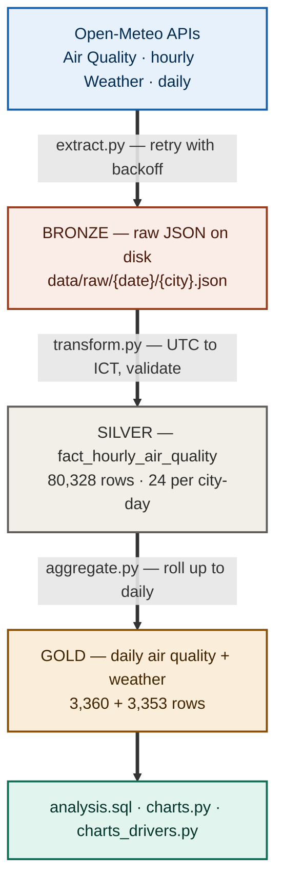

Raw JSON stays on disk so transforms can be re-run without re-fetching. The three
storage tiers follow the bronze/silver/gold pattern used by modern lakehouses.

| Property | How |
|---|---|
| Idempotent | `INSERT ... ON CONFLICT DO UPDATE` — verified by running the same day three times and counting rows |
| Fault-tolerant | `tenacity` retries transient network errors; per-city `try/except` keeps one failure from costing the other five |
| Observable | Timestamped logs to `logs/etl_{date}.log`, non-zero exit code on failure |
| Tested | 9 unit tests on timezone conversion and validation rules |

### Data quality

Validation runs in three tiers, on the principle that one bad column should not
discard a whole row:

| Check | Action | Rationale |
|---|---|---|
| Missing key | **Drop row** | Cannot be stored |
| Negative reading | **Set NULL, keep row** | Physically meaningless, but the other columns still hold |
| PM2.5 > 1000 µg/m³ | **Flag, keep row** | Could be a genuine wildfire |
| PM2.5 > PM10 | **Log ERROR, keep row** | PM2.5 is a subset of PM10 — a violation is certainly a source error |

Across all 80,328 rows: **zero violations**. The rules stay as a guard against
future schema drift.

The `dust` variable was dropped: it returned 0.0 across all six cities for the
entire period. Cross-checking against Dubai (24–72 µg/m³) confirmed the model
does not cover Southeast Asia, rather than the request being malformed.

### Analytical methods

- **Completeness filter.** Every analytical query filters on `hours_recorded = 24`.
  Partial days would otherwise average in as if complete.
- **Within-city deciles.** Dirty/clean day comparisons cut the deciles inside each
  city, then average across the six — so the comparison is about days, not places.
- **Bucketing alongside correlation.** A weak Pearson coefficient can hide a real
  non-linear effect; both are reported where they disagree (see the rain finding).
- **Partial correlation** to hold wind constant one factor at a time, computed in
  plain SQL: `r(A,B|C) = [r(A,B) − r(A,C)·r(B,C)] / sqrt[(1−r(A,C)²)(1−r(B,C)²)]`.
- **Significance testing** where a coefficient is small enough to doubt
  (PM2.5–ozone, PM2.5–rain).
- **Repeatability check.** With two Aprils in the data, a pattern is only called a
  pattern if it appears in both years. Months with fewer than 20 complete days are
  dropped from the series.

### Design decisions

| Decision | Why | Alternative considered |
|---|---|---|
| Keep raw JSON before transforming | Re-run transforms without re-fetching; fix past bugs retroactively | Transform in flight — loses the ability to correct history |
| Natural key `(city_id, datetime_utc)` | Foundation for idempotent upserts; the database itself rejects duplicates | `SERIAL` — silently duplicates rows on re-run |
| `datetime_utc` as `TIMESTAMPTZ`, `datetime_local` as `TIMESTAMP` | `TIMESTAMPTZ` normalises to UTC internally, so two such columns would store identical values | Both as `TIMESTAMPTZ` — caught in schema review, before any data was loaded |
| Aggregate `target_date` **and** `target_date + 1` | A UTC batch feeds two local dates at +7h | Aggregating one date — measured a **34% error** on Can Tho before this was fixed |
| `hours_recorded` on the daily table | Separates a complete day from a partial one | Assuming completeness — the 34% error stayed invisible without this column |
| Per-city error isolation | One city failing doesn't cost the other five | Global try/except — a single failure loses the whole day |
| Collect six pollutants, not just PM2.5 | Made the Da Nang ozone finding and the Hanoi/HCMC source split possible | PM2.5 only — cheaper, and would have produced a confidently wrong ranking |

---

## Key findings

### 1. Four of six cities exceed the WHO guideline on more than 85% of days

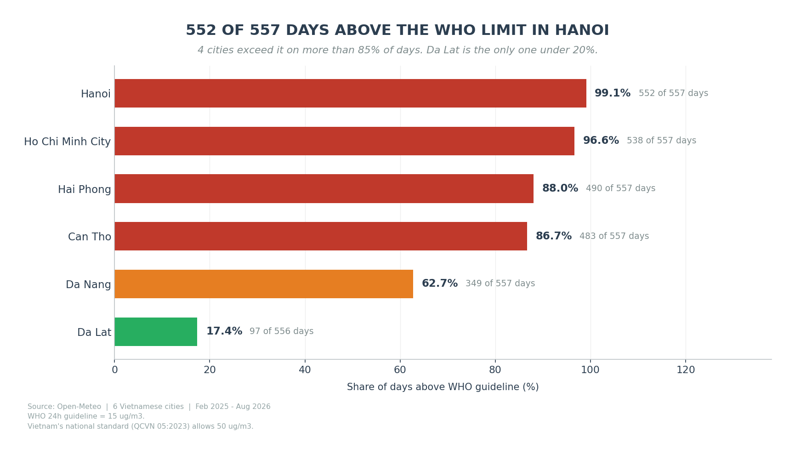

Hanoi exceeded on **552 of 557 days** (99.1%). Da Lat is the exception at 17.4%,
and it recorded **no sustained pollution episode at all** in eighteen months.

Da Lat is not proof that the other five could reach the same level — it sits on a
plateau with little industry and a different climate, so its cleanliness is
confounded with its geography. What it does establish is that the readings are not
a measurement artefact: the same pipeline, the same API and the same thresholds
produce very different numbers for a city with different surroundings.

Patterns repeat, which makes them patterns rather than events. Plotting all
nineteen months in sequence shows Hanoi peaking at 68.9 then 67.0 µg/m³ two Aprils
running. Ho Chi Minh City runs in antiphase: April is its *cleanest* month.

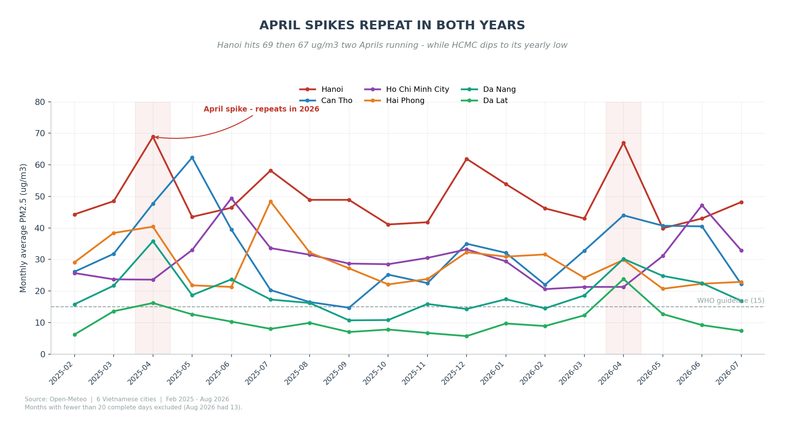

### 2. It is not one problem — it is at least three

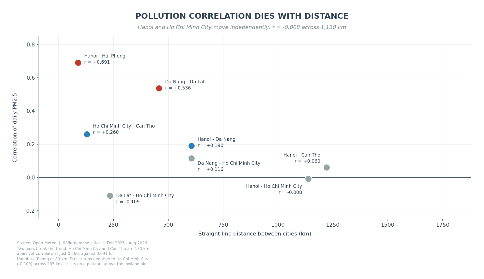

Hanoi and Ho Chi Minh City correlate at **−0.008**. A bad day in one says nothing
about the other.

| Pair | Correlation | Distance |
|---|---|---|
| Hanoi – Hai Phong | **0.691** | ~100 km |
| Da Nang – Da Lat | 0.536 | ~600 km |
| HCMC – Can Tho | 0.260 | ~170 km |
| Hanoi – HCMC | **−0.008** | ~1,700 km |
| Da Lat – HCMC | −0.109 | ~300 km |

Three systems that rise and fall independently. That does not make national
measures pointless — a fuel standard would reach every city regardless. What it
rules out is treating the country as one air shed: an alert issued for Hanoi
carries no information about Ho Chi Minh City.

### 3. It is not one pollutant — the ranking flips

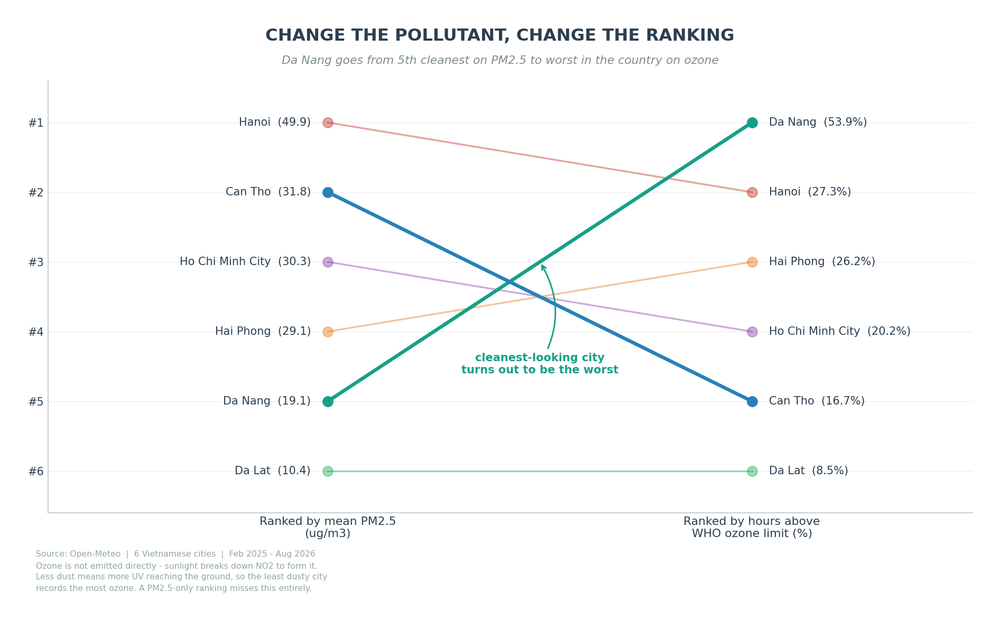

Da Nang ranks **5th of 6 on PM2.5** and **1st of 6 on ozone**, with 53.9% of hours
above the WHO limit — twice Hanoi's share.

Ozone is not emitted directly; it forms when sunlight breaks down NO₂, and it
tracks UV at r = 0.516. Less airborne dust means more UV reaching ground level,
which offers a plausible route from "low PM2.5" to "high ozone". The direct link
is real but small: r = −0.128 over 80,472 hourly readings (t = −36.7, comfortably
distinguishable from zero) — under 2% of the variance. Treat this as a mechanism
the data is consistent with, not one it establishes.

A "cleanest cities in Vietnam" ranking built on PM2.5 would put Da Nang near the
top and miss its actual problem entirely.

### 4. It is not one cause — the two big cities have different fingerprints

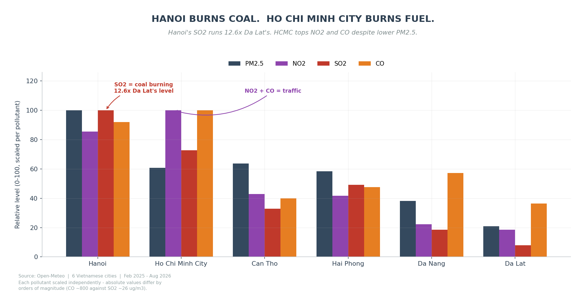

SO₂ is a coal marker: modern vehicles run on desulphurised fuel and emit almost
none. Hanoi's SO₂ averages **12.6 times Da Lat's level** and crosses the WHO limit
in one hour out of eight.

Ho Chi Minh City instead leads on NO₂ and CO — the traffic pair — exceeding the
NO₂ limit in **65% of hours** despite ranking only third on PM2.5.

Same symptom, different causes, and therefore different remedies. This only became
visible because the pipeline collects six pollutants rather than PM2.5 alone.

### 5. Weather modulates the emissions, and wind is the only consistent factor

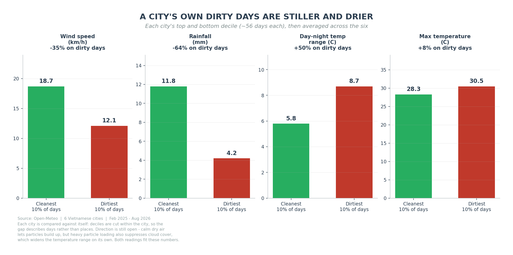

On a city's own worst days, wind is **35% weaker**, rainfall **64% lower**, and the
day-night temperature range **50% wider**.

The direction is not settled. Calm dry weather plausibly lets particles accumulate
— but heavy particle loading also suppresses cloud formation, which would widen
the temperature range on its own. Both readings fit these numbers.

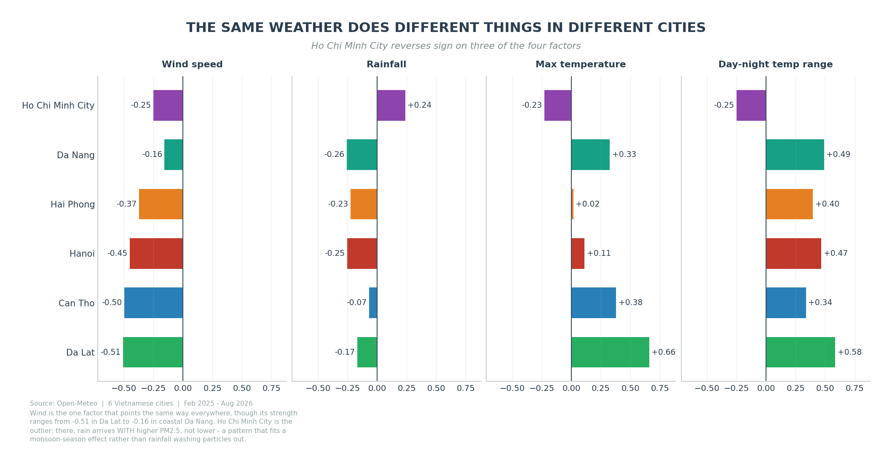

Wind points the same way everywhere — negative in all four seasons and all six
cities — though its strength ranges from −0.51 in Da Lat to −0.16 in coastal Da
Nang. It is the only factor in this dataset that behaves consistently, and it
still accounts for only about **12%** of the day-to-day variation.

Ho Chi Minh City reverses sign on three of the four factors. Rain there arrives
*with* higher PM2.5, which fits monsoon seasonality better than rainfall washing
particles out.

### 6. Rain helps, but less than either summary suggests

Rain is the clearest case of a signal that two different summaries each get wrong,
in opposite directions.

**The coefficient understates it.** Pearson correlation between rainfall and PM2.5
is only **−0.094**, which reads as "no relationship". Bucketing by intensity shows
every bucket declining in order, with dry days *gaining* +1.57 µg/m³ against the
previous day and heavy-rain days *losing* −1.71. The coefficient is low because
46% of days fall into the light-rain bucket, where the effect is near zero — and
it is a real signal, not noise (t = −5.4 over 3,341 days).

**The buckets overstate it.** Rainy days are also windier (r = +0.137), so part of
what looks like rain clearing the air is wind doing it. Holding wind constant cuts
the coefficient from −0.094 to −0.050 — roughly half. The 20% gap between dry and
heavy-rain days is what a resident experiences; only about half of it belongs to
the rain.

> [!NOTE]
> A weak correlation means the relationship is not linear, not that it does not
> exist — and a clear gap between groups does not mean the labelled factor caused
> it.
>
> 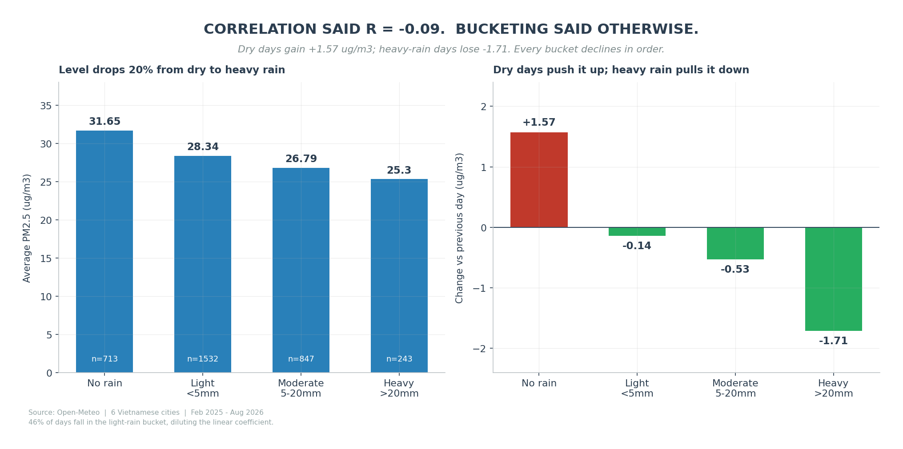

### 7. Episodes arrive abruptly, so PM2.5 carries no early-warning signal

Averaged over 223 episode onsets — every day that crossed 35 µg/m³ straight after a
day below it — PM2.5 *drifts downward* for three days (33.8, 30.4, 28.9) and then
jumps to 43.0, a **49% rise overnight**.

That rules out gradual accumulation and points to a discrete trigger: a wind
shift, an incoming air mass. Forecasting would have to lean on meteorology rather
than on the PM2.5 series itself.

---

## Hypothesis testing

Each of these was an explanation that seemed obvious enough to state without
checking. Four fail a specific test; one — the temperature signal — holds up under
two.

| Hypothesis | Prediction | Result |
|---|---|---|
| Traffic drives the daily cycle | Peaks at rush hour; weekends cleaner | ❌ Peaks at **6am and 10pm**; weekends **equal or worse** in all six cities |
| Thermal inversion explains the overnight peak | PM2.5 rises with day-night range; larger amplitude in winter | ❌ Range: 22.1 → 29.8 → 30.0 → **27.7** (non-monotonic). Amplitude: summer **35.6** vs winter **30.2** |
| The temperature signal is a seasonal artefact | Splitting by season dissolves it | ✅ Survives — **strengthens** to +0.414 summer, +0.409 autumn; holds 85% of strength with wind held constant |
| April's peak comes from field burning | CO rises with PM2.5 | ❌ PM2.5 rises 24–52% while CO **falls 10–13%** in Hanoi, Hai Phong, Can Tho |
| Episodes build up gradually | PM2.5 trends up before onset | ❌ Drifts *down* three days, then jumps **49% overnight** |

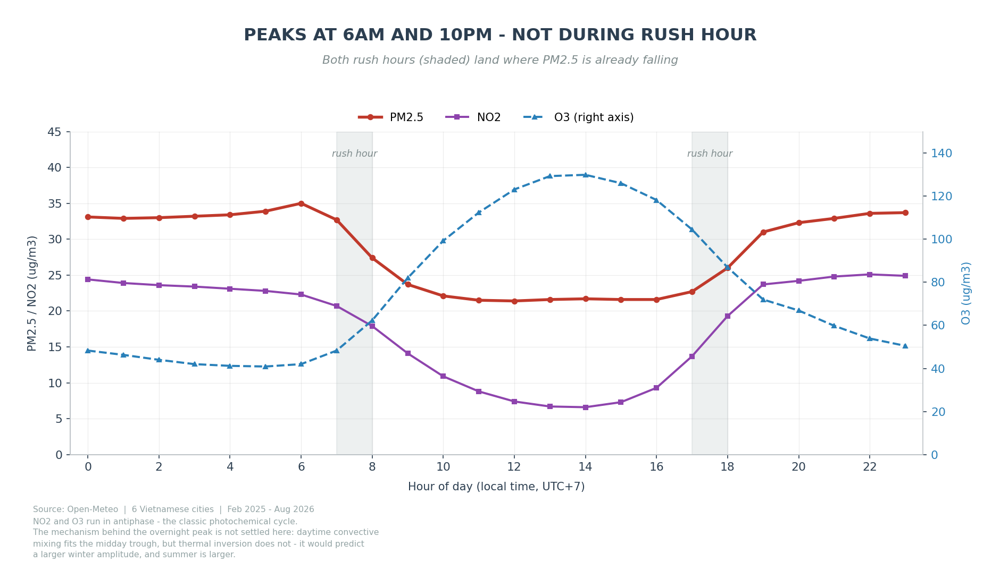

**On inversion.** This sits alongside finding 5 rather than against it. Comparing
the extreme deciles, dirty days really do have a 50% wider temperature range. But
across the full range the relationship stops being monotonic — and inversion
requires monotonicity, since a wider range should mean a stronger cap every time.
A difference between extremes is not the same as a mechanism that scales. Daytime
convective mixing fits the midday trough better, but the positive temperature
correlation cuts against that too. The mechanism is genuinely unresolved.

**On temperature.** It was the weakest of the five going in, and it is the only one
still standing after two separate checks — seasonal splitting and a partial
correlation holding wind constant (+0.233 → +0.197).

**On April.** April is one of seven months with two years of data behind it.
January and September–December rest on a single year, so their figures carry less
weight — the charts mark them.

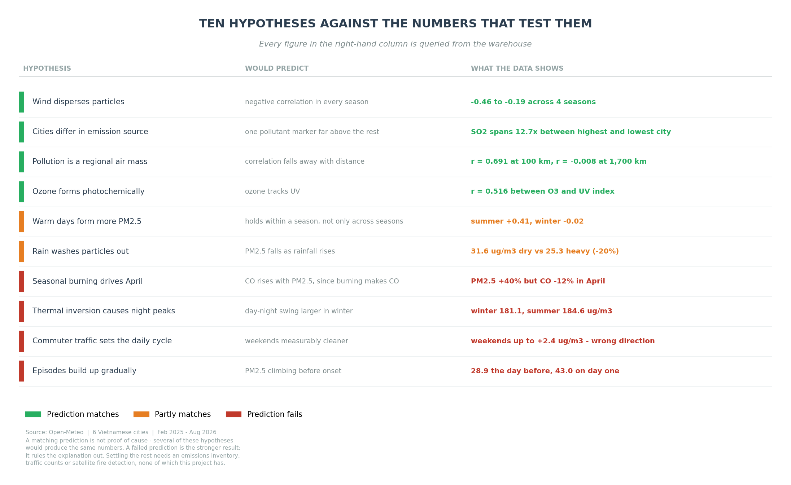

Of the ten hypotheses charted, four predictions match the data, two match in part,
and four fail outright. The failures are the more useful half: several surviving
hypotheses would produce identical numbers, and this dataset has no emissions
inventory, no traffic counts and no fire-detection data to tell them apart. A
**failed** prediction rules an explanation out; a matching one only fails to rule
it out.

<sub>Supporting charts:
[weather correlations, raw and wind-adjusted](charts/04_weather_correlation.png) ·
[bad-day share by month](charts/06_month_heatmap.png) ·
[sustained episodes](charts/08_episodes.png)</sub>

<sub>An earlier version of the hypothesis chart scored each one on a 0–1 "weight of
evidence" scale. Those scores were invented — there was no rule behind them, so
they are gone. Every figure above is queried from the warehouse and recomputed
whenever the charts are regenerated.</sub>

---

## What the analysis establishes

- **Daily variation is regional, not national.** Three groups of cities move
  independently, so monitoring and alerting have to be regional even where policy
  is national.
- **There is more than one kind of problem.** Particulate and photochemical
  pollution rank the cities differently and would need different responses.
- **Weather modulates rather than creates.** It decides whether particles disperse
  or accumulate, not whether they are emitted. Even wind, the strongest factor,
  accounts for about 12% of the day-to-day variation.
- **Four intuitive explanations fail a specific test each** — and one that was
  expected to fail did not.

Settling which of the surviving explanations dominates would need an emissions
inventory, satellite fire detection (NASA FIRMS), wind direction, and traffic
counts. All outside this project's scope, and all named in the code comments where
they would fit.

---

## Limitations

- **No orchestration yet.** The pipeline exposes `--yesterday` and `--lookback N`
  for a scheduler, but nothing calls them automatically. Windows Task Scheduler was
  skipped deliberately in favour of moving straight to Airflow. The cron
  equivalent:
  ```
  0  6 * * *  cd /path/to/airquality-etl && venv/bin/python -m src.main --yesterday
  30 6 * * 0  cd /path/to/airquality-etl && venv/bin/python -m src.main --lookback 7
  ```
- **Charts regenerate manually.** They read live from the database, so they are
  never more than one run stale — but nothing schedules them.
- **Eighteen months is too short for trend claims.** Only February–August overlaps
  across both years. Patterns repeating in both years are treated as patterns;
  anything appearing once is treated as an event.
- **Only pairwise controls, not a full model.** Partial correlations hold wind
  constant one factor at a time. A regression controlling for all three at once
  would be stronger; the three are only weakly correlated with each other
  (|r| < 0.15), so the difference is likely small, but it has not been tested.
- **Significance is reported only where the coefficient is small enough to doubt.**
  PM2.5–ozone and PM2.5–rain were tested and both clear the threshold. The larger
  coefficients are not in question at these sample sizes.
- **Correlation is not causation.** The hypothesis section reports what each
  prediction implies against what was measured; it does not rank the survivors,
  because this dataset offers no principled way to do so.
- **No failure alerting**, **no Docker packaging**, **local PostgreSQL only**.

---

## Getting started

### Prerequisites

Python 3.13 · PostgreSQL 15 · no API key needed

### Setup

```bash
git clone https://github.com/Tuong1308/airquality-etl.git
cd airquality-etl

python -m venv venv && source venv/Scripts/activate    # Linux/macOS: venv/bin/activate
pip install -r requirements.txt

cp .env.example .env                                    # fill in your database password
psql -U postgres -c "CREATE DATABASE airquality;"
psql -U <user> -d airquality -f sql/schema.sql
```

### Running the pipeline

```bash
python -m src.main --date 2026-06-01                    # one specific day
python -m src.main --yesterday                          # what a scheduler would call
python -m src.main --start-date 2025-02-01 --end-date 2026-08-12   # backfill
python -m src.main --lookback 7                         # re-run last week, filling gaps
python -m src.charts                                    # regenerate the descriptive charts
python -m src.charts_drivers                            # regenerate the driver-evidence charts
pytest                                                  # 9 tests, no network, 0.8s
```

A single day takes **~16 seconds** across all six cities. The full 18-month
backfill — 558 days, roughly 6,700 API calls — runs in about **1.6 hours**.

> [!TIP]
> Every figure quoted in this README comes from a query in
> [`sql/analysis.sql`](sql/analysis.sql); chart captions recompute theirs at render
> time, so nothing here can drift out of step with the database.

---

<sub>Python 3.13 · PostgreSQL 15 · pandas · SQLAlchemy · psycopg2 · tenacity · pytest · matplotlib · Data: <a href="https://open-meteo.com">Open-Meteo</a></sub>